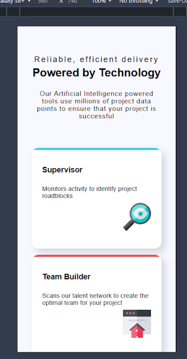
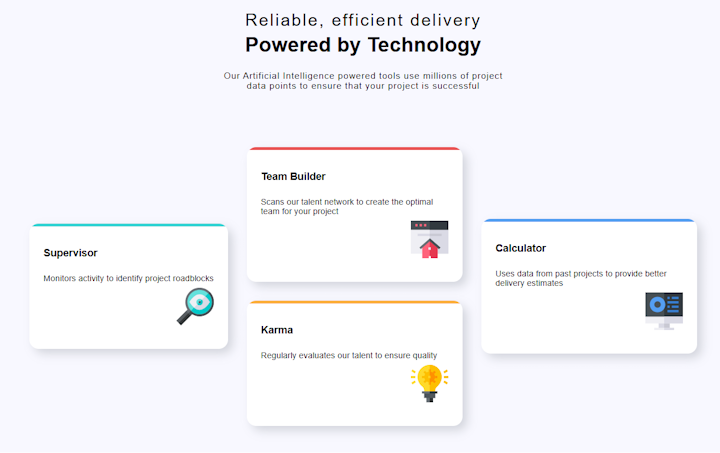

# Four card feature section

This is my implementation of the [Four card feature section challenge on Frontend Mentor](https://www.frontendmentor.io/challenges/four-card-feature-section-weK1eFYK). 
Frontend Mentor challenges help you improve your coding skills by building realistic projects. 

## Table of contents

- [Overview](#overview)
  - [Screenshots](#screenshots)
  - [Links](#links)
- [My process](#my-process)
  - [Built with](#built-with)
  - [What I learned](#what-i-learned)
  - [AI Collaboration](#ai-collaboration)
- [Author](#author)

## Overview

### Screenshots

#### Mobile screenshot



#### Desktop screenshot



### Links

- Solution URL: https://github.com/FJSolutions/fm-four-card-feature
- Live Site URL: https://fjsolutions.github.io/fm-four-card-feature/

## My process

### Built with

- Semantic HTML5 markup
- CSS custom properties
- Flexbox
- CSS Grid
- Mobile-first workflow
- [LightingCSS](https://lightningcss.dev/)
- [Vite](https://vite.dev/)

### What I learned

It was good to learn how to add `vite` to an existing project and configure it from scratch manually.
I also integrated `ligtningcss` directly through the `cite.config.js`, which was also a first.

I stuck to a semantic markup for the`html` that looked acceptable with the browser's default styles.
I had to think differently about not adding elements for styling purposes that had to semantic meaning!

```html

<main>
  <article class="card card-supervisor">
    <h2>Supervisor</h2>
    <p>
      Monitors activity to identify project roadblocks
    </p>
    <picture>
      
    </picture>
  </article>
  <!--  ... other markup  -->
</main>
```

The biggest `css` lesson I learned was with using `overflow: hidden` on the card component with the use 
of a `::before` pseudo-selector for creating the coloured top border for each of the cards that only 
started half way up the curve in the corner.    

```css
.card {
  overflow: hidden;
  /* Other styles */
}

.card-supervisor::before {
  position: absolute;
  content: "";
  /* Other styles */
}
```

### Continued development

Use this section to outline areas that you want to continue focusing on in future projects. These could be concepts you're still not completely comfortable with or techniques you found useful that you want to refine and perfect.

### AI Collaboration

I did not make use of the IDE's inline AI, but I did access Gemini in the browser to point myself
in the right direction and verify my ideas.  

## Author

- Frontend Mentor - [Francis Judge](https://www.frontendmentor.io/profile/@FJSolutions)
